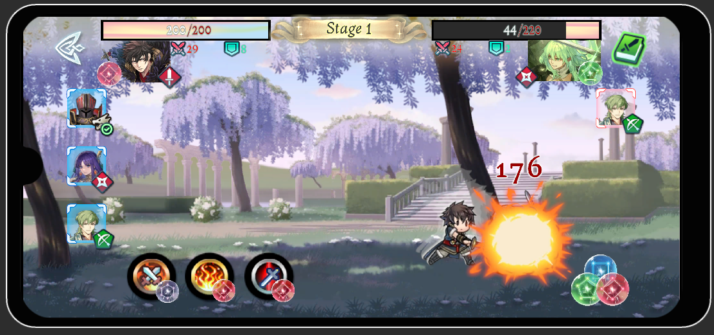
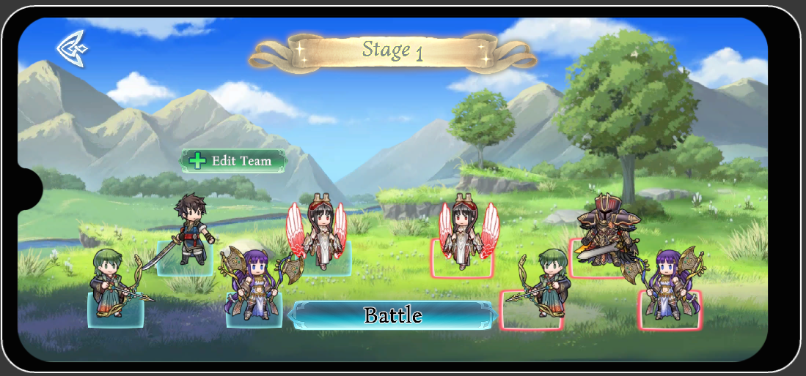

# 🌟 World Shards ⚔️

> _Forge your destiny in a world torn apart by elemental chaos_

<div align="center">


**🎮 Turn-Based RPG | 📱 Mobile Gaming | ⚡ Elemental Combat**

</div>

---

## 🌍 **Welcome to a Shattered World**

**World Shards** is an immersive turn-based RPG adventure crafted in Unity for Android devices. Journey through a realm fractured by ancient elemental wars, where you'll assemble legendary heroes, master strategic combat, and uncover the mysteries behind the world's destruction.

### ⭐ **What Makes World Shards Special?**

- 🧙‍♂️ **Deep Character Customization** - Build your ultimate team
- ⚔️ **Strategic Combat System** - Master class and elemental advantages
- 🎲 **Gacha Collection** - Summon powerful heroes
- 📱 **Mobile-Optimized** - Designed for seamless mobile gameplay

---

## 🔥 **Epic Features**

### 🛡️ **Secure Cloud Authentication**

- 🔐 **Unity Cloud Integration** - Your progress follows you everywhere
- 👤 **Persistent Identity** - Secure login system with cloud sync
- 💾 **Cross-Device Continuity** - Never lose your data

### 🎯 **Strategic Character Management**

- 🏛️ **Diverse Classes** - Warriors, SwordMasters, Mages, Archers, Rogues, Healers, Tanks, Monks and more
- 🌊 **Elemental Mastery** - Wood, Water, Fire, and Neutral elements
- ⚡ **Skill Combinations** - Each character wields 3 unique abilities
- 🎭 **Class Warfare** - Exploit weaknesses, amplify strengths
- 🔥 **Elemental Clashes** - Turn the battlefield to your advantage

### 🚀 **Character Progression System**

- 📈 **Level Advancement** - Grow stronger with every upgrade
- 💪 **Stat Enhancement** - Customize your heroes' capabilities
- 🏆 **Team Synergy** - Build the perfect combination

### 🎰 **Summoning & Collection**

- ✨ **Gacha Magic** - Discover new heroes
- 📚 **Hero Collection** - Build your roster of champions
- 🎁 **Surprise Encounters** - New allies await your call

### ⚔️ **Tactical Combat Experience**

- 🎯 **Strategic Lineup** - Position matters in battle
- 🧩 **Team Composition** - Balance offense, defense, and support
- 🏅 **Victory Conditions** - Multiple paths to triumph

### 🗺️ **Epic Journey**

- 🌄 **Story Campaigns** - Unravel the world's mysteries
- 🔓 **Progressive Unlocks** - New challenges await
- 🎢 **Escalating Difficulty** - Test your strategic mastery

### 🎵 **Immersive Audio Experience**

- 🎼 **Dynamic Soundtrack** - Music that adapts to your journey
- 🔊 **Spatial Sound Effects** - Every spell and strike comes alive
- 🎧 **Centralized Audio Control** - Perfect balance for mobile gaming

---

## 📱 **Mobile-First Design**

- 🎨 **Intuitive Touch Controls** - Designed for fingers, not cursors
- 📲 **Responsive Interface** - Optimized for all Android devices
- ⚡ **Performance Optimized** - Smooth gameplay on any device
- 🔋 **Battery Efficient** - Long gaming sessions without worry

---

## 🎬 **Visual Showcase**

### 📸 **Game Screenshots**

<div align="center">

|          ⚔️ **Epic Battles**          |         👥 **Team Formation**          |
| :-----------------------------------: | :------------------------------------: |
|  |  |
|     _Strategic turn-based combat_     |      _Customize your dream team_       |

</div>

### 🎥 **Gameplay Demo**

<div align="center">

[](https://www.youtube.com/watch?v=YOUR_VIDEO_ID)

_Experience World Shards in action!_

</div>

---

## 🛠️ **Built With Cutting-Edge Tech**

<div align="center">

|     Technology      |         Purpose          |   Version   |
| :-----------------: | :----------------------: | :---------: |
| 🎮 **Unity Engine** |  Core Game Development   | 2022.3.35f1 |
| ☁️ **Unity Cloud**  | Authentication & Backend |   Latest    |
| 🤖 **Android SDK**  |     Mobile Platform      |   API 21+   |
| 💻 **C# Language**  |   Game Logic & Systems   |    .NET     |

</div>

---

## 🚀 **Get Started**

### 📥 **Quick Download**

<div align="center">

[](https://drive.google.com/drive/folders/1yEmvUFmDVFLH-hOxPSviUjv1IoZnIZHb?usp=sharing)

_Get the latest version and start your adventure!_

</div>

### 🔧 **Developer Setup**

```bash
# Clone the legendary repository
git clone https://github.com/DylasCoding/WorldShards.git

# Open in Unity and let the magic begin! ✨
```

---

## 🎯 **Why Play World Shards?**

<div align="center">

| 🎲 **For Strategy Lovers** |  📱 **For Mobile Gamers**   |    🎨 **For RPG Fans**     |
| :------------------------: | :-------------------------: | :------------------------: |
|    Deep tactical combat    | Optimized mobile experience | Rich character progression |
| Class & element synergies  |  Touch-friendly interface   |  Immersive world-building  |
|  Strategic team building   |   Play anywhere, anytime    |    Epic story campaigns    |

</div>

---

## 🌟 **Join the Adventure**

<div align="center">

**🎮 Ready to enter the shattered world?**

_Download World Shards today and discover what legends are made of!_

[](https://github.com/DylasCoding/WorldShards)
[](https://github.com/DylasCoding/WorldShards/issues)

</div>

---

<div align="center">

_Made with ❤️ by passionate game developers_

**🌟 May your journey through the World Shards be legendary! 🌟**

</div>
