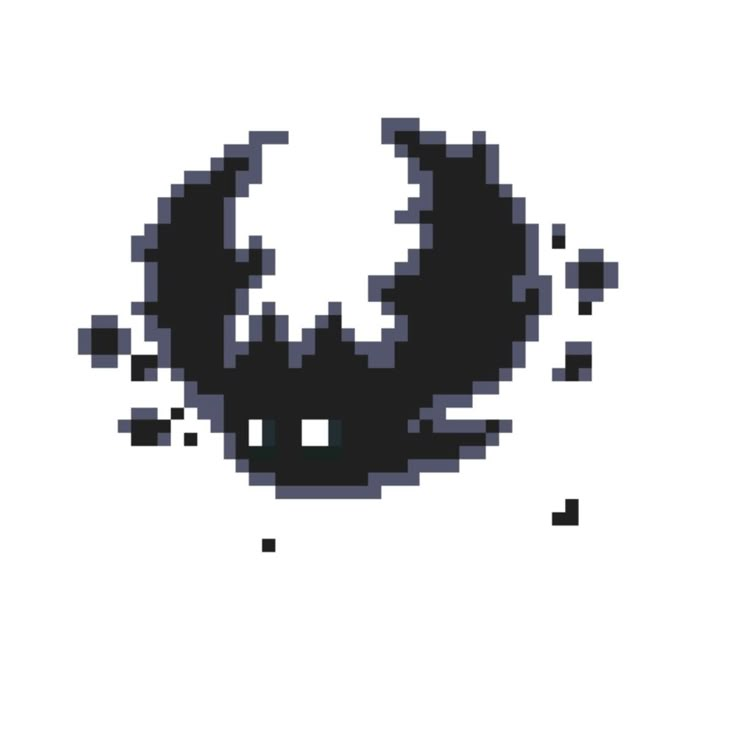
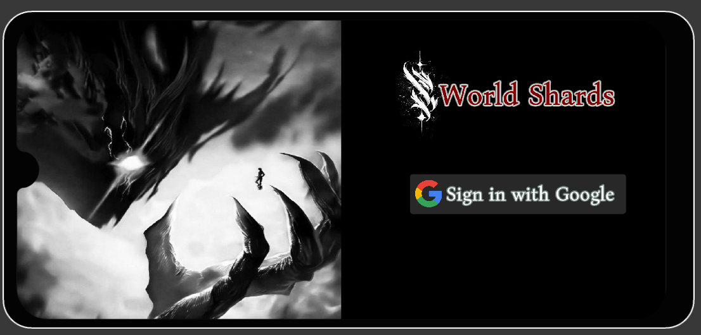
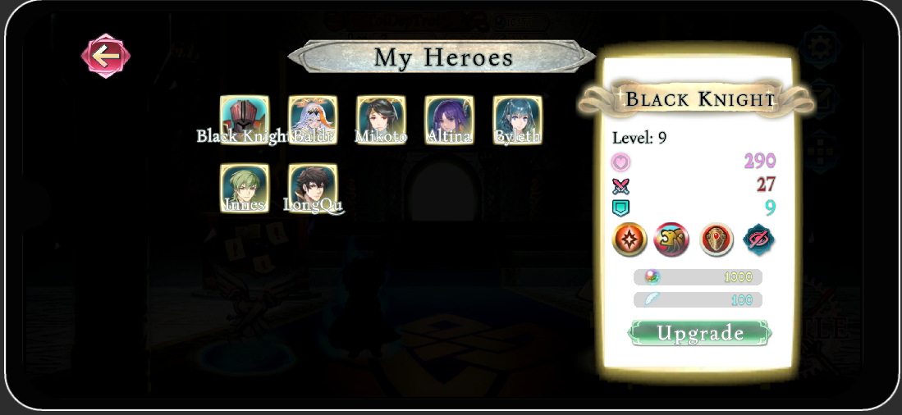
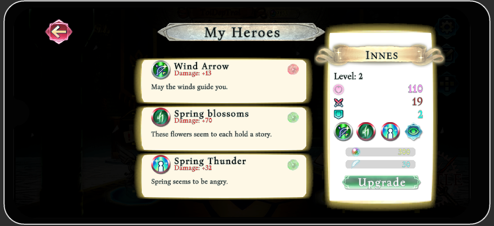

<p align="center">
  
</p>

<h1 align="center">World Shards</h1>

**World Shards** is a turn-based RPG (T-RPG) game developed in Unity, designed for Android devices. Set in a world shattered by elemental conflict, players summon and build powerful teams of characters to explore stages, battle enemies, and uncover the story behind the fractured realms.

## 🚀 Features

### 🔐 Authentication

- Unity Cloud Authentication system
- Supports secure login and user identity management

### 📱 Platform Support

- Built for **Android** using Unity
- Optimized UI/UX for mobile devices

### 🧑‍💼 Player Profile Management

- Persistent player data (name, progress, team, inventory)
- Player progression is saved and synced with the cloud

### 🔊 Audio Manager

- Centralized audio control system
- Dynamic music and sound effects based on game states

### 🧙 Character System

- Manage a roster of unique characters
- Each character has:
  - A **Class** (e.g., Warrior, Mage, etc.)
  - An **Element** (Wood, Water, Fire, None)
  - **3 Skills** (each skill may have its own Element)
- **Class Clash System**: Classes interact with strengths/weaknesses
- **Element Clash System**: Elemental advantages impact battle outcomes

### 🔧 Character Development

- Upgrade character level, stats, and skills
- Enhance your team’s power for tougher challenges

### ✨ Summon System

- Gacha-style character summoning system
- Pull new characters and grow your collection

### 📊 Team Line-Up

- Form and customize your active team
- Strategic lineup affects combat performance

### 🗺️ Stage Progression

- Unlock and conquer story-based stages
- Increasing difficulty and boss battles

---

## 📸 Screenshots & Video

### 📷 Screenshots






### 🎬 Demo Video

[](https://www.youtube.com/watch?v=YOUR_VIDEO_ID)

---

## 🛠️ Tech Stack

- **Game Engine:** Unity
- **Backend/Auth:** Unity Cloud
- **Target Platform:** Android
- **Language:** C#

---

## 📦 Installation & Build Instructions

1. Clone this repository:
   ```bash
   git clone https://github.com/DylasCoding/WorldShards.git
   ```

## 📥 Download

[Download Latest APK](https://drive.google.com/drive/folders/1yEmvUFmDVFLH-hOxPSviUjv1IoZnIZHb?usp=sharing)
